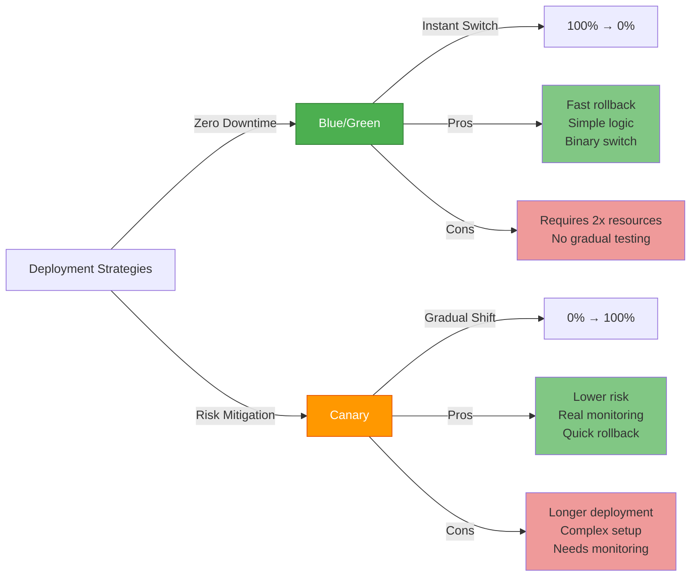
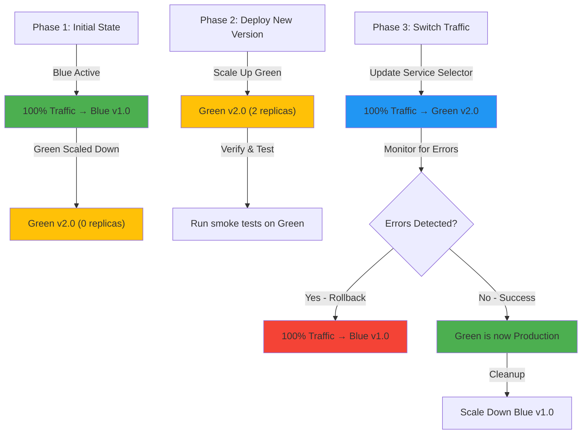
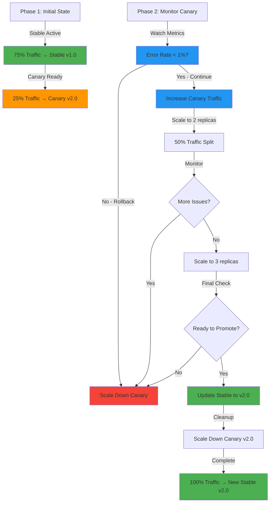

# Kubernetes Deployment Strategies

A practical demonstration of Blue/Green and Canary deployment strategies in Kubernetes using a simple Python web service.

## Table of Contents

- [Overview](#overview)
- [Prerequisites](#prerequisites)
- [Project Structure](#project-structure)
- [GitHub Actions](#github-actions)
- [Quick Start](#quick-start)
- [Unit Testing](#unit-testing)
- [Blue/Green Deployment](#bluegreen-deployment)
- [Canary Deployment](#canary-deployment)
- [Load Testing](#load-testing)
- [Troubleshooting](#troubleshooting)

## Overview

This project demonstrates two common Kubernetes deployment strategies:

### Deployment Strategies Comparison



### Blue/Green Deployment
- **Blue** = Current production version (v1.0)
- **Green** = New version ready to deploy (v2.0)
- **Strategy**: Switch traffic instantly from Blue to Green by updating service selector
- **Rollback**: Instant switch back to Blue if issues detected
- **Downtime**: Zero downtime (both versions coexist)

### Canary Deployment
- **Stable** = Current version serving majority of traffic (v1.0)
- **Canary** = New version serving small percentage of traffic (v2.0)
- **Strategy**: Gradually increase canary traffic percentage
- **Monitoring**: Validate canary version before full promotion
- **Rollback**: Simple scale-down of canary pods

## Prerequisites

### Required Tools
- **Kubernetes cluster**: minikube, microk8s, or any local K8s environment
- **kubectl**: Kubernetes command-line tool (v1.20+)
- **Docker**: For building container images
- **k6**: For load testing (https://k6.io)

### System Requirements
- 4+ GB RAM available for local K8s cluster
- 2+ CPU cores
- ~5 GB disk space

### Installation

**macOS/Linux with Homebrew:**
```bash
# Install k6
brew install k6

# Install minikube (if not already installed)
brew install minikube
```

**Windows with Chocolatey:**
```powershell
# Install k6
choco install k6

# Install minikube
choco install minikube
```

**Docker Desktop:**
If using Docker Desktop, Kubernetes can be enabled from settings (Preferences → Kubernetes → Enable Kubernetes).

## Project Structure

```
tech-challenge-devops/
├── app/                          # Python web service
│   ├── Dockerfile               # Container image definition
│   ├── app.py                   # Flask application
│   └── requirements.txt          # Python dependencies
├── k8s/                         # Kubernetes manifests
│   ├── 00-namespace.yaml        # Deployment namespace
│   ├── 01-blue-green.yaml       # Blue/Green deployment setup
│   └── 02-canary.yaml           # Canary deployment setup
├── scripts/                     # Management scripts (deprecated - see .github/workflows/scripts/)
│   ├── blue-green-manager.sh    # Moved to .github/workflows/scripts/
│   └── canary-manager.sh        # Moved to .github/workflows/scripts/
├── load-tests/                  # Load testing scripts (deprecated - see test/load/)
│   ├── blue-green-test.js       # Moved to test/load/
│   ├── canary-test.js           # Moved to test/load/
│   └── smoke-test.js            # Moved to test/load/
├── test/                       # Test suite
│   ├── unit/                    # Unit tests
│   │   └── test_app.py          # Flask app unit tests
│   └── load/                    # k6 load testing scripts
│       ├── smoke-test.js        # Quick smoke test
│       ├── blue-green-test.js   # Blue/Green deployment load test
│       └── canary-test.js       # Canary deployment load test
├── pytest.ini                   # Pytest configuration
│   ├── build-docker-image.yml   # Build and push Docker images
│   ├── deploy-kubernetes.yml    # Deploy to Kubernetes cluster
│   ├── run-load-tests.yml       # Execute k6 load tests (manual)
│   ├── switch-blue-green.yml    # Switch Blue/Green deployments (manual)
│   ├── manage-canary.yml        # Manage Canary deployment (manual)
│   └── scripts/                 # Deployment management scripts
│       ├── blue-green-manager.sh   # Blue/Green management script
│       └── canary-manager.sh       # Canary management script
├── README.md                    # This file
└── devops-challenge.pdf         # Challenge requirements
```

## GitHub Actions

This project includes automated CI/CD workflows for building, deploying, and testing.

### Available Workflows

#### 1. Build Docker Image (`build-docker-image.yml`)
**Trigger**: Automatically on push to `main`/`develop` or PR with changes to `app/`

- Builds Docker image with automatic version tagging
- Uses Docker Buildx for efficient multi-stage builds
- Uploads image artifact for later use
- Tags image as: `web-service:<version>` and `web-service:latest`

#### 2. Deploy to Kubernetes (`deploy-kubernetes.yml`)
**Trigger**: Manual workflow dispatch (GitHub UI)

**Inputs**:
- **Deployment strategy**: Choose `blue-green` or `canary`
- **Target environment**: Choose `staging` or `production`
- **Image version**: Specify Docker image version to deploy

**Actions**:
- Creates deployment namespace
- Applies selected Kubernetes manifests
- Waits for all deployments to be ready (300s timeout)
- Verifies pods and services
- Generates deployment summary in GitHub

**Example**: Deploy Blue/Green strategy to staging environment

#### 3. Run Load Tests (`run-load-tests.yml`)
**Trigger**: Manual workflow dispatch (GitHub UI)

**Inputs**:
- **Test type**: `smoke-test`, `blue-green-test`, `canary-test`, or `all-tests`
- **Service URL**: Target URL to test (default: `http://localhost:80`)
- **Duration**: Optional test duration override

**Test Options**:
- `smoke-test`: Quick health verification (10 seconds, 1 user)
- `blue-green-test`: Full load test with ramp-up/down
- `canary-test`: Long-running test tracking version distribution
- `all-tests`: Run all three tests sequentially

**Note**: For testing local Minikube deployments, use:
```bash
# In local terminal, create tunnel to service
kubectl port-forward svc/web-service 8080:80 -n deployment-strategies

# Then trigger workflow with URL: http://localhost:8080
```

Or expose via ngrok:
```bash
ngrok http 8080
# Use the ngrok URL in the workflow
```

#### 4. Switch Blue/Green Deployment (`switch-blue-green.yml`)
**Trigger**: Manual workflow dispatch (GitHub UI)

**Actions**:
- `status`: Show current active deployment (blue or green)
- `switch-to-green`: Switch traffic to green version
- `switch-to-blue`: Switch traffic back to blue version
- `scale-green`: Scale up green deployment
- `scale-blue`: Scale up blue deployment

Executes the `blue-green-manager.sh` script from GitHub Actions.

#### 5. Manage Canary Deployment (`manage-canary.yml`)
**Trigger**: Manual workflow dispatch (GitHub UI)

**Actions**:
- `status`: Show traffic distribution across stable and canary
- `start-canary`: Begin canary rollout with 1 replica (~25% traffic)
- `scale-canary`: Scale canary to N replicas (specify in "Replicas" input)
- `promote-canary`: Promote canary to stable version
- `rollback-canary`: Roll back by scaling down canary

Executes the `canary-manager.sh` script from GitHub Actions.

#### 6. Run Unit Tests (`run-unit-tests.yml`)
**Trigger**: Automatically on push to `main`/`develop` or PR with changes to `app/` or `test/unit/`

**Test Coverage**:
- Tests on Python 3.9, 3.10, and 3.11
- Runs pytest with coverage reporting
- Tests all Flask endpoints (/, /health, /version, /api/info)
- Validates error handling and HTTP methods
- Generates coverage HTML reports as artifacts

**Example Coverage Areas**:
- Endpoint status codes (200, 404, etc.)
- JSON response format and structure
- Environment variable handling
- Error handling (404 errors)
- Response headers

### Typical CI/CD Workflow

```
1. Developer pushes code
   ↓
2. run-unit-tests.yml runs automatically (Python 3.9, 3.10, 3.11)
   ↓
3. build-docker-image.yml builds and tags image
   ↓
4. Team manually triggers deploy-kubernetes.yml
   ↓
5. Service deployed to cluster
   ↓
6. Team manually triggers run-load-tests.yml
   ↓
7. Load tests validate deployment
   ↓
8. Use switch-blue-green.yml or manage-canary.yml to manage traffic
```

### Accessing Workflows in GitHub

1. Go to repository → **Actions** tab
2. Select workflow from left sidebar
3. Click **Run workflow** button
4. Fill in required inputs
5. Click **Run workflow**
6. Monitor execution in real-time
7. View results and summary after completion

All workflows generate summaries in GitHub Actions UI for easy tracking and debugging.

## Quick Start

### 1. Start Local Kubernetes Cluster

**Using Minikube:**
```bash
minikube start --cpus=4 --memory=4096
minikube addons enable ingress
```

**Using Docker Desktop:**
- Open Docker Desktop settings
- Go to Kubernetes tab
- Check "Enable Kubernetes"
- Wait for cluster to start

### 2. Build and Load Container Image

```bash
# Build the Docker image
docker build -t web-service:1.0 ./app

# For Blue/Green, also build v2.0 (with minor code changes)
docker build -t web-service:2.0 ./app

# Load images into Minikube (if using Minikube)
minikube image load web-service:1.0
minikube image load web-service:2.0
```

### 3. Deploy to Kubernetes

```bash
# Create namespace and deploy Blue/Green
kubectl apply -f k8s/00-namespace.yaml
kubectl apply -f k8s/01-blue-green.yaml

# Verify deployment
kubectl get pods -n deployment-strategies
kubectl get services -n deployment-strategies
```

### 4. Access the Service

**Get service URL:**
```bash
# For Minikube
minikube service web-service -n deployment-strategies

# For Docker Desktop
kubectl port-forward svc/web-service 8080:80 -n deployment-strategies
# Then access: http://localhost:8080
```

## Unit Testing

This project includes comprehensive unit tests for the Flask application using pytest.

### Running Unit Tests Locally

**Install test dependencies:**
```bash
pip install -r app/requirements.txt
```

**Run all unit tests:**
```bash
pytest test/unit/ -v
```

**Run tests with coverage report:**
```bash
pytest test/unit/ --cov=app --cov-report=html
# Open htmlcov/index.html to view coverage report
```

**Run specific test class:**
```bash
pytest test/unit/test_app.py::TestHealthEndpoint -v
```

**Run specific test function:**
```bash
pytest test/unit/test_app.py::TestHealthEndpoint::test_health_returns_200 -v
```

### Test Coverage

The unit tests cover:
- **Endpoint Status Codes**: Verify all endpoints return correct HTTP status
- **Response Format**: Ensure all responses are valid JSON with correct structure
- **Response Content**: Validate required fields in each endpoint response
- **Error Handling**: Test 404 and other error responses
- **HTTP Methods**: Verify endpoints accept/reject appropriate HTTP methods
- **Response Headers**: Check correct Content-Type and other headers
- **Environment Variables**: Test handling of SERVICE_VERSION and SERVICE_NAME

### Test Structure

Tests are organized into logical test classes:
- `TestIndexEndpoint`: Tests for `/` endpoint
- `TestHealthEndpoint`: Tests for `/health` endpoint
- `TestVersionEndpoint`: Tests for `/version` endpoint
- `TestInfoEndpoint`: Tests for `/api/info` endpoint
- `TestErrorHandling`: Tests for error responses
- `TestHTTPMethods`: Tests for HTTP method handling
- `TestResponseHeaders`: Tests for response headers

### CI/CD Integration

Unit tests run automatically on:
- Push to `main` or `develop` branches
- Pull requests to `main` branch
- Changes to `app/` or `test/unit/` folders

Tests run on Python 3.9, 3.10, and 3.11 simultaneously to ensure compatibility.

## Blue/Green Deployment

### Strategy Overview

Blue/Green is ideal for:
- Zero-downtime deployments
- Quick rollbacks
- Binary switch between versions
- Simple traffic switching

### Workflow Diagram



### Key Characteristics
- **Deployment Time**: Minutes (scale up → test → switch)
- **Rollback Time**: Seconds (instant service selector switch)
- **Traffic Split**: 0/100 or 100/0 (binary)
- **Risk Level**: Moderate (test thoroughly before switch)

### Workflow

1. **Initial State**: Blue is active, Green is scaled to 0
2. **Deploy Green**: Scale up new version (v2.0)
3. **Verify**: Test Green before switching
4. **Switch**: Update service selector to route to Green
5. **Decommission Blue**: Scale down old version

### Using the Management Script

```bash
# Check current status
./scripts/blue-green-manager.sh status

# Scale up green deployment
./scripts/blue-green-manager.sh scale-green

# Switch traffic to green
./scripts/blue-green-manager.sh switch-to-green

# Switch back to blue (rollback)
./scripts/blue-green-manager.sh switch-to-blue

# Test both versions
./scripts/blue-green-manager.sh test-both
```

### Manual Process Example

```bash
# 1. Start with blue active
kubectl get service web-service -n deployment-strategies -o jsonpath='{.spec.selector}'

# 2. Scale up green
kubectl scale deployment web-service-green -n deployment-strategies --replicas=2

# 3. Wait for green pods
kubectl wait --for=condition=available deployment/web-service-green -n deployment-strategies

# 4. Switch service to green
kubectl patch service web-service -n deployment-strategies \
  -p '{"spec":{"selector":{"slot":"green"}}}'

# 5. Verify traffic goes to green
kubectl logs -n deployment-strategies -l slot=green -f
```

## Canary Deployment

### Strategy Overview

Canary is ideal for:
- Risk mitigation with new versions
- Monitoring metrics before full rollout
- Gradual traffic shifting
- Easy rollback

### Workflow Diagram



### Key Characteristics
- **Deployment Time**: Hours/Days (gradual rollout)
- **Rollback Time**: Minutes (scale down canary)
- **Traffic Split**: Gradual increase (10% → 25% → 50% → 100%)
- **Risk Level**: Low (catch issues early with small traffic)
- **Monitoring**: Critical (must monitor metrics continuously)

### Traffic Shifting Scenarios

| Step | Stable | Canary | Traffic % | Duration |
|------|--------|--------|-----------|----------|
| 1    | 3      | 1      | 75% / 25% | 5 min    |
| 2    | 3      | 2      | 60% / 40% | 10 min   |
| 3    | 3      | 3      | 50% / 50% | 15 min   |
| 4    | 3      | 3      | Complete  | Promote  |

### Using the Management Script

```bash
# Check current status
./scripts/canary-manager.sh status

# Start canary with 1 replica
./scripts/canary-manager.sh start-canary

# Gradually scale canary
./scripts/canary-manager.sh scale-canary 2
./scripts/canary-manager.sh scale-canary 3

# Monitor traffic distribution
./scripts/canary-manager.sh test-traffic

# Promote canary to stable (make it the primary)
./scripts/canary-manager.sh promote-canary

# Or rollback to stable only
./scripts/canary-manager.sh rollback-canary
```

### Manual Process Example

```bash
# 1. Check current distribution
kubectl get pods -n deployment-strategies -l app=web-service-canary --show-labels

# 2. Start canary with 1 replica (25% traffic)
kubectl scale deployment web-service-canary -n deployment-strategies --replicas=1

# 3. Monitor responses from different versions
for i in {1..20}; do
  kubectl run test-$i --image=curlimages/curl:latest --rm -i --restart=Never -- \
    curl -s http://service-ip/version | jq .version
done

# 4. Gradually increase canary traffic
kubectl scale deployment web-service-canary -n deployment-strategies --replicas=2
kubectl scale deployment web-service-canary -n deployment-strategies --replicas=3

# 5. Promote: update stable to use canary version
kubectl set image deployment/web-service-stable \
  web-service=web-service:2.0 -n deployment-strategies
kubectl set env deployment/web-service-stable SERVICE_VERSION=2.0 -n deployment-strategies

# 6. Scale down canary
kubectl scale deployment web-service-canary -n deployment-strategies --replicas=0
```

## Load Testing

### k6 Scripts Included

1. **smoke-test.js** - Quick health verification (10 seconds, 1 user)
2. **blue-green-test.js** - Tests all endpoints with ramp-up/down
3. **canary-test.js** - Long-running test tracking version distribution

### Running Load Tests

```bash
# Smoke test (quick verification)
k6 run test/load/smoke-test.js

# Blue/Green load test
k6 run --env SERVICE_URL=http://localhost:8080 test/load/blue-green-test.js

# Canary load test (60+ seconds)
k6 run --env SERVICE_URL=http://localhost:8080 test/load/canary-test.js
```

### Interpreting Results

k6 provides:
- **Request Duration**: p95/p99 percentiles show response time distribution
- **Error Rate**: Percentage of failed requests
- **Throughput**: Requests per second over time
- **Version Distribution** (canary): Shows traffic split between stable/canary

Example output:
```
checks...................: 100% 250 out of 250
http_req_duration........: avg=45ms p(95)=120ms p(99)=250ms
http_req_failed..........: 0.0% 0 out of 250
iteration_duration.......: avg=5.5s
iterations...............: 250
```

### Load Test Scenarios

**Blue/Green Validation:**
1. Run load test against blue (baseline)
2. Scale green, run load test
3. Switch to green, run load test
4. Compare metrics to verify green performs similarly

**Canary Validation:**
1. Run canary test with 10% traffic
2. Monitor error rate and latency
3. If acceptable, increase to 30%
4. Repeat until 100%

## Monitoring and Debugging

### View Logs

```bash
# Blue deployment logs
kubectl logs -n deployment-strategies -l slot=blue -f

# Green deployment logs
kubectl logs -n deployment-strategies -l slot=green -f

# Canary (stable) logs
kubectl logs -n deployment-strategies -l track=stable -f

# Canary (canary) logs
kubectl logs -n deployment-strategies -l track=canary -f

# All logs in namespace
kubectl logs -n deployment-strategies -l app=web-service -f
```

### Verify Endpoints

```bash
# Get service IP
SERVICE_IP=$(kubectl get svc web-service -n deployment-strategies -o jsonpath='{.status.loadBalancer.ingress[0].ip}')

# Test endpoints
curl http://$SERVICE_IP/
curl http://$SERVICE_IP/health
curl http://$SERVICE_IP/version
curl http://$SERVICE_IP/api/info
```

### Check Pod Status

```bash
# Get pod details
kubectl get pods -n deployment-strategies -o wide

# Describe a specific pod
kubectl describe pod <pod-name> -n deployment-strategies

# Check pod events
kubectl get events -n deployment-strategies --sort-by='.lastTimestamp'
```

## Troubleshooting

### Issue: Pods not starting

```bash
# Check pod logs
kubectl logs <pod-name> -n deployment-strategies

# Check pod events
kubectl describe pod <pod-name> -n deployment-strategies

# Check resource availability
kubectl top nodes
kubectl top pods -n deployment-strategies
```

### Issue: Service not accessible

```bash
# Verify service exists
kubectl get svc -n deployment-strategies

# Check service endpoints
kubectl get endpoints web-service -n deployment-strategies

# Forward port locally
kubectl port-forward svc/web-service 8080:80 -n deployment-strategies
```

### Issue: Image pull errors

```bash
# For Minikube, load images
minikube image load web-service:1.0
minikube image load web-service:2.0

# Verify images
minikube image ls | grep web-service
```

### Issue: Deployment stuck pending

```bash
# Check deployment status
kubectl describe deployment web-service-blue -n deployment-strategies

# Check for resource constraints
kubectl describe nodes

# Try clearing and restarting
kubectl delete deployment web-service-blue -n deployment-strategies
kubectl apply -f k8s/01-blue-green.yaml
```

## Complete Demo Walkthrough

### Blue/Green Demo (15 minutes)

```bash
# 1. Setup (5 min)
minikube start --cpus=4 --memory=4096
docker build -t web-service:1.0 ./app
docker build -t web-service:2.0 ./app  # (make a small code change first)
minikube image load web-service:1.0 web-service:2.0
kubectl apply -f k8s/

# 2. Verify Blue is active (2 min)
./scripts/blue-green-manager.sh status
kubectl logs -n deployment-strategies -l slot=blue -f &

# 3. Run load test (3 min)
kubectl port-forward svc/web-service 8080:80 -n deployment-strategies &
k6 run --env SERVICE_URL=http://localhost:8080 load-tests/smoke-test.js

# 4. Switch to Green (3 min)
./scripts/blue-green-manager.sh scale-green
./scripts/blue-green-manager.sh switch-to-green
./scripts/blue-green-manager.sh status

# 5. Verify traffic on Green (2 min)
k6 run load-tests/smoke-test.js
```

### Canary Demo (20 minutes)

```bash
# 1. Delete Blue/Green, deploy Canary (3 min)
kubectl delete -f k8s/01-blue-green.yaml
kubectl apply -f k8s/02-canary.yaml

# 2. Start canary (2 min)
./scripts/canary-manager.sh status
./scripts/canary-manager.sh start-canary

# 3. Monitor traffic distribution (5 min)
k6 run --env SERVICE_URL=http://localhost:8080 load-tests/canary-test.js &
watch -n 1 './scripts/canary-manager.sh status'

# 4. Gradually promote (8 min)
./scripts/canary-manager.sh scale-canary 2
sleep 30
./scripts/canary-manager.sh scale-canary 3
sleep 30
./scripts/canary-manager.sh promote-canary

# 5. Verify complete (2 min)
./scripts/canary-manager.sh status
```

## Best Practices

- **Always test in staging** before deploying to production
- **Monitor metrics** during deployment (CPU, memory, latency, errors)
- **Set up proper observability** (logging, metrics, tracing)
- **Automate rollbacks** when error rate exceeds threshold
- **Use service mesh** (Istio, Linkerd) for advanced traffic management
- **Implement readiness/liveness probes** for better health detection
- **Test rollback procedures** regularly

## Additional Resources

- [Kubernetes Documentation](https://kubernetes.io/docs/)
- [Blue/Green Deployment Pattern](https://martinfowler.com/bliki/BlueGreenDeployment.html)
- [Canary Deployments](https://cloud.google.com/architecture/continuous-delivery-patterns)
- [k6 Load Testing](https://k6.io/docs/)
- [Deployment Strategies Comparison](https://harness.io/blog/blue-green-canary-deployment-strategies/)

## License

This project is for educational purposes.

## Support

For issues or questions:
1. Check the [Troubleshooting](#troubleshooting) section
2. Review pod logs: `kubectl logs -n deployment-strategies -l app=web-service`
3. Check Kubernetes events: `kubectl get events -n deployment-strategies`
